# Architecture Diagrams

This document contains all visual architecture diagrams for the Azure File Upload Application. These diagrams illustrate the system from multiple perspectives: application architecture, Azure infrastructure, authentication flow, SAS token generation, and complete data flow.

## Quick Reference

| Diagram | Purpose | Best For |
|---------|---------|----------|
| [Application Architecture](#application-architecture) | Component interactions and data flow | Understanding code structure |
| [Azure Infrastructure](#azure-infrastructure) | Azure resources and RBAC | Understanding deployment and costs |
| [SAS Token Flow](#sas-token-generation-flow) | Detailed sequence of SAS generation | Understanding security model |
| [Authentication Flow](#authentication--authorization-flow) | Credential discovery and validation | Troubleshooting auth issues |
| [Data Flow](#complete-data-flow) | End-to-end data transformations | Understanding the upload journey |

---

## Application Architecture

Shows how the React frontend, Fastify API, and Azure services interact, with emphasis on the SAS token generation flow.

```mermaid
graph TB
    %% User and Frontend
    User[👤 User] --> Frontend[React Frontend<br/>Vite + Material-UI<br/>Port 5173/8080]
    
    %% Frontend interactions with API
    Frontend -->|1. Request SAS Token<br/>GET /api/sas| API
    Frontend -->|3. Upload File<br/>PUT with SAS URL| Storage
    Frontend -->|4. List Files<br/>GET /api/list| API
    
    %% API Server
    subgraph "API Server (Fastify)"
        API[API Routes<br/>Port 3000]
        API --> SASRoute[SAS Token Route<br/>/api/sas]
        API --> ListRoute[List Files Route<br/>/api/list]
        API --> StatusRoute[Status Route<br/>/api/status]
        API --> HealthRoute[Health Check<br/>/health]
        
        SASRoute --> AzureStorage[Azure Storage Client<br/>@azure/storage-blob]
        ListRoute --> AzureStorage
        StatusRoute --> AzureStorage
        
        AzureStorage --> Credential[DefaultAzureCredential<br/>@azure/identity]
    end
    
    %% Azure Services
    subgraph "Azure Services"
        Credential -.Authenticates with.-> ManagedIdentity[Managed Identity<br/>User-Assigned]
        ManagedIdentity -.RBAC: Storage Blob<br/>Data Contributor.-> Storage
        ManagedIdentity -.RBAC: Storage<br/>Blob Delegator.-> Storage
        
        Storage[(Azure Blob Storage<br/>StorageV2<br/>Container: 'upload')]
        
        ManagedIdentity -.Provides identity to.-> API
    end
    
    %% SAS Token Generation Flow (detailed)
    SASRoute -->|2a. Request User<br/>Delegation Key| Storage
    Storage -->|2b. Return User<br/>Delegation Key| SASRoute
    SASRoute -->|2c. Generate SAS<br/>signed with key| SASToken[SAS Token URL<br/>Time-limited<br/>Permission-scoped]
    SASToken -->|2d. Return to client| Frontend
    
    %% Styling
    classDef userClass fill:#E1F5FF,stroke:#0078D4,stroke-width:2px
    classDef frontendClass fill:#FFF4E1,stroke:#FF8C00,stroke-width:2px
    classDef apiClass fill:#E8F5E9,stroke:#4CAF50,stroke-width:2px
    classDef azureClass fill:#F3E5F5,stroke:#9C27B0,stroke-width:2px
    classDef storageClass fill:#E3F2FD,stroke:#2196F3,stroke-width:3px
    classDef securityClass fill:#FFEBEE,stroke:#F44336,stroke-width:2px
    
    class User userClass
    class Frontend frontendClass
    class API,SASRoute,ListRoute,StatusRoute,HealthRoute,AzureStorage apiClass
    class Storage storageClass
    class Credential,ManagedIdentity,SASToken securityClass
```

**Key Points**:
- Frontend uploads files **directly to Azure Storage** (not through API)
- API only generates SAS tokens (minimal bandwidth usage)
- Managed Identity provides keyless authentication
- RBAC enforces least-privilege access

---

## Azure Infrastructure

Complete view of all Azure resources, their relationships, and RBAC role assignments.

```mermaid
graph TB
    %% External
    User[👤 Users<br/>Browser] --> WebApp
    Developer[👨‍💻 Developer<br/>CLI/Portal] -.Deploys with.-> AZD[Azure Developer CLI<br/>azd up]
    
    %% Azure Subscription
    subgraph AzureSub["☁️ Azure Subscription"]
        
        %% Resource Group
        subgraph RG["📦 Resource Group<br/>rg-{env}"]
            
            %% Security & Identity
            subgraph Security["🔐 Security & Identity"]
                MI[User-Assigned<br/>Managed Identity<br/>No secrets/keys]
            end
            
            %% Monitoring
            subgraph Monitoring["📊 Monitoring"]
                LAW[Log Analytics<br/>Workspace<br/>30-day retention]
            end
            
            %% Container Infrastructure
            subgraph ContainerInfra["🐳 Container Infrastructure"]
                ACR[Azure Container<br/>Registry<br/>Basic SKU<br/>Stores: api, web images]
                
                ACAEnv[Container Apps<br/>Environment<br/>Zone: Single AZ]
            end
            
            %% Applications
            subgraph Applications["⚙️ Applications"]
                APIApp[API Container App<br/>Fastify + TypeScript<br/>Port: 3000<br/>Scale: 0-1 replicas<br/>CPU: 0.5, RAM: 1Gi]
                
                WebApp[Web Container App<br/>React + Vite<br/>Port: 8080<br/>Scale: 1-3 replicas<br/>CPU: 0.5, RAM: 1Gi]
            end
            
            %% Storage
            subgraph Storage["💾 Storage"]
                SA[(Storage Account<br/>StorageV2, Standard_LRS<br/>Container: 'upload'<br/>CORS enabled<br/>Public blob access)]
            end
            
            %% Connections
            ACAEnv -.Hosts.-> APIApp
            ACAEnv -.Hosts.-> WebApp
            ACAEnv -.Sends logs to.-> LAW
            
            ACR -.Provides images to.-> APIApp
            ACR -.Provides images to.-> WebApp
            
            APIApp -->|File operations<br/>SAS generation| SA
            WebApp -->|Direct file upload<br/>with SAS token| SA
            
            %% RBAC Relationships (dashed lines)
            MI -.RBAC:<br/>Storage Blob Data<br/>Contributor.-> SA
            MI -.RBAC:<br/>Storage Blob<br/>Delegator.-> SA
            MI -.RBAC:<br/>AcrPull.-> ACR
            
            MI -.Assigned to.-> APIApp
            MI -.Assigned to.-> WebApp
        end
        
        %% Deployment
        AZD -.Provisions.-> RG
        AZD -.Builds & pushes.-> ACR
        AZD -.Deploys apps.-> APIApp
        AZD -.Deploys apps.-> WebApp
    end
    
    %% Environment Variables Flow
    SA -.AZURE_STORAGE_<br/>ACCOUNT_NAME.-> APIApp
    MI -.AZURE_CLIENT_ID.-> APIApp
    APIApp -.API_URL.-> WebApp
    
    %% Styling
    classDef userClass fill:#E1F5FF,stroke:#0078D4,stroke-width:3px
    classDef securityClass fill:#FFEBEE,stroke:#F44336,stroke-width:3px
    classDef monitoringClass fill:#FFF9C4,stroke:#FBC02D,stroke-width:2px
    classDef containerClass fill:#E8F5E9,stroke:#4CAF50,stroke-width:2px
    classDef appClass fill:#F3E5F5,stroke:#9C27B0,stroke-width:2px
    classDef storageClass fill:#E3F2FD,stroke:#2196F3,stroke-width:3px
    classDef deployClass fill:#FFF3E0,stroke:#FF9800,stroke-width:2px
    
    class User,Developer userClass
    class MI securityClass
    class LAW monitoringClass
    class ACR,ACAEnv containerClass
    class APIApp,WebApp appClass
    class SA storageClass
    class AZD deployClass
```



**Key Resources**:
- **Managed Identity**: Eliminates secrets/keys from application
- **Container Apps**: Scale-to-zero capable (API), always-on (Web)
- **Storage Account**: CORS-enabled for direct browser uploads
- **RBAC Roles**: Storage Blob Data Contributor, Storage Blob Delegator, AcrPull

**Cost Optimization**:
- Basic SKU for ACR (minimal cost)
- Standard_LRS for Storage (lowest redundancy cost)
- API scales to zero when idle
- Single availability zone (no zone redundancy premium)

---

## SAS Token Generation Flow

Detailed 28-step sequence showing how User Delegation SAS tokens are generated and used.

```mermaid
sequenceDiagram
    participant User as 👤 User
    participant Frontend as React Frontend
    participant API as Fastify API
    participant Identity as Managed Identity
    participant Entra as Microsoft Entra ID
    participant Storage as Azure Blob Storage
    
    %% File Selection
    User->>Frontend: 1. Select file (photo.jpg)
    Frontend->>Frontend: Validate file size (< 256KB)
    
    %% SAS Token Request
    Note over Frontend,API: Phase 1: Request SAS Token
    Frontend->>API: 2. GET /api/sas?file=photo.jpg<br/>&container=upload&permission=w<br/>&timerange=10
    
    %% CORS Preflight
    Note over API: Check CORS origin
    API-->>Frontend: OPTIONS 200 (CORS OK)
    
    %% Authentication Flow
    Note over API,Entra: Phase 2: Authenticate with Azure
    API->>Identity: 3. Get credential<br/>(DefaultAzureCredential)
    Identity->>Entra: 4. Request OAuth token<br/>(using Managed Identity)
    Entra->>Entra: Validate identity
    Entra-->>Identity: 5. Return access token
    Identity-->>API: 6. Return credential
    
    %% User Delegation Key Request
    Note over API,Storage: Phase 3: Get User Delegation Key
    API->>Storage: 7. getUserDelegationKey()<br/>startsOn: now<br/>expiresOn: now+10min
    Storage->>Entra: 8. Validate token & RBAC<br/>(Storage Blob Delegator)
    Entra-->>Storage: 9. Authorization granted
    Storage-->>API: 10. Return User Delegation Key<br/>(temporary signing key)
    
    %% SAS Token Generation
    Note over API: Phase 4: Generate SAS Token
    API->>API: 11. generateBlobSASQueryParameters()<br/>- containerName: upload<br/>- blobName: photo.jpg<br/>- permissions: write<br/>- startsOn, expiresOn<br/>- userDelegationKey
    API->>API: 12. HMAC-SHA256 signature<br/>with user delegation key
    API->>API: 13. Construct SAS URL:<br/>https://{account}.blob.core.windows.net<br/>/upload/photo.jpg?sv=...&sig=...
    
    %% Return SAS to Frontend
    API-->>Frontend: 14. Return JSON:<br/>{ "url": "https://...?{sas-params}" }
    Frontend->>Frontend: Store SAS URL in state
    
    %% File Upload
    Note over Frontend,Storage: Phase 5: Upload File Directly to Storage
    User->>Frontend: 15. Click "Upload"
    Frontend->>Frontend: 16. Convert File to ArrayBuffer
    Frontend->>Storage: 17. PUT /upload/photo.jpg<br/>with SAS query params<br/>Body: file data
    
    %% SAS Validation
    Storage->>Storage: 18. Validate SAS:<br/>- Signature matches?<br/>- Not expired?<br/>- Permission = write?
    Storage->>Entra: 19. Verify user delegation key<br/>still valid
    Entra-->>Storage: 20. Key valid
    
    %% Store File
    Storage->>Storage: 21. Write blob to container
    Storage-->>Frontend: 22. 201 Created
    
    %% Success Feedback
    Frontend->>User: 23. Show success message
    Frontend->>API: 24. GET /api/list?container=upload
    API->>Storage: 25. listBlobsFlat()
    Storage-->>API: 26. Return blob list
    API-->>Frontend: 27. Return JSON: { "list": [...] }
    Frontend->>User: 28. Display uploaded files
    
    %% Styling
    Note over User,Storage: ✅ Keyless Authentication<br/>✅ Time-Limited SAS (10 min)<br/>✅ RBAC-Enforced<br/>✅ Direct Upload (no proxy)
```



**Security Highlights**:
- **No account keys used** - User Delegation Key is temporary and identity-based
- **RBAC enforced** - Entra ID validates permissions at steps 8 and 19
- **Time-limited** - SAS expires in 10 minutes (configurable)
- **Audit trail** - All operations logged in Azure Activity Log

---

## Authentication & Authorization Flow

Shows how DefaultAzureCredential discovers and uses Managed Identity for keyless authentication.

```mermaid
graph TB
    %% Application Startup
    Start([Container App Starts]) --> LoadEnv[Load Environment Variables<br/>AZURE_STORAGE_ACCOUNT_NAME<br/>AZURE_CLIENT_ID optional]
    
    LoadEnv --> CreateCred[Create DefaultAzureCredential<br/>@azure/identity]
    
    %% Credential Discovery Process
    subgraph CredentialChain["🔍 Credential Discovery Chain"]
        CreateCred --> CheckEnv{Environment<br/>Variables?}
        CheckEnv -->|Yes| EnvCred[EnvironmentCredential<br/>CLIENT_ID, CLIENT_SECRET, TENANT_ID]
        CheckEnv -->|No| CheckMI
        
        EnvCred -->|Not found| CheckMI{Managed<br/>Identity?}
        CheckMI -->|Azure| IMDS[Query Azure IMDS<br/>http://169.254.169.254/metadata/identity]
        CheckMI -->|Local| CheckAzCLI
        
        IMDS -->|Success| MICred[ManagedIdentityCredential<br/>User-Assigned]
        IMDS -->|Fail| CheckAzCLI
        
        CheckAzCLI{Azure CLI<br/>Logged In?}
        CheckAzCLI -->|Yes| AzCLICred[AzureCliCredential<br/>Uses: az account get-access-token]
        CheckAzCLI -->|No| FailCred[❌ Credential Not Found]
    end
    
    %% Successful Credential Flow
    MICred --> VerifyPerms[Verify Storage Permissions<br/>verify-permissions.ts]
    AzCLICred --> VerifyPerms
    
    subgraph PermVerification["✅ Permission Verification Tests"]
        VerifyPerms --> Test1[Test 1: Storage Account Exists<br/>getAccountInfo]
        Test1 -->|Success| Test2[Test 2: Can Get User Delegation Key<br/>Validates: Storage Blob Delegator role]
        Test2 -->|Success| Test3[Test 3: Can List Blobs<br/>Validates: Storage Blob Data Contributor]
        Test3 -->|Success| AllGood[✅ All Permissions Verified]
        
        Test1 -->|Fail| LogError1[❌ Storage account not found<br/>or network blocked]
        Test2 -->|Fail| LogError2[❌ Missing Storage Blob Delegator role]
        Test3 -->|Fail| LogError3[❌ Missing Storage Blob Data Contributor role]
    end
    
    %% Start Server
    AllGood --> StartServer[Start Fastify Server<br/>Port 3000]
    LogError1 --> StartServer
    LogError2 --> StartServer
    LogError3 --> StartServer
    
    StartServer --> Ready[🚀 API Ready for Requests]
    
    %% Runtime Authentication
    Ready --> Request[Incoming Request<br/>/api/sas]
    
    subgraph RuntimeAuth["🔐 Runtime Authentication (Per Request)"]
        Request --> UseCred[Use DefaultAzureCredential<br/>from startup]
        UseCred --> GetToken{Token<br/>Cached?}
        GetToken -->|Yes| UseToken[Use Cached Token]
        GetToken -->|No| RequestToken[Request New Token from<br/>Microsoft Entra ID]
        
        RequestToken --> EntraValidate[Entra ID Validates:<br/>1. Identity exists<br/>2. Identity not disabled<br/>3. Requested scope valid]
        EntraValidate --> IssueToken[Issue OAuth Access Token<br/>Audience: storage.azure.com<br/>Valid: 1 hour]
        
        IssueToken --> UseToken
        UseToken --> MakeAPICall[Make Azure Storage API Call<br/>Authorization: Bearer {token}]
    end
    
    MakeAPICall --> StorageValidate[Storage Validates:<br/>1. Token signature<br/>2. Token not expired<br/>3. RBAC permissions]
    
    StorageValidate -->|Authorized| Success[✅ Operation Succeeds]
    StorageValidate -->|Unauthorized| Fail[❌ 403 Forbidden]
    
    %% Error Handling
    FailCred --> ShowError[Display Error:<br/>Run 'az login' locally<br/>or configure Managed Identity]
    Fail --> LogRBACError[Log RBAC Error<br/>with Azure CLI commands<br/>to diagnose]
    
    %% Styling
    classDef startClass fill:#E8F5E9,stroke:#4CAF50,stroke-width:2px
    classDef credClass fill:#FFF9C4,stroke:#FBC02D,stroke-width:2px
    classDef testClass fill:#E3F2FD,stroke:#2196F3,stroke-width:2px
    classDef successClass fill:#C8E6C9,stroke:#66BB6A,stroke-width:3px
    classDef errorClass fill:#FFCDD2,stroke:#F44336,stroke-width:2px
    classDef runtimeClass fill:#F3E5F5,stroke:#9C27B0,stroke-width:2px
    
    class Start,LoadEnv,CreateCred startClass
    class CheckEnv,CheckMI,CheckAzCLI,EnvCred,MICred,AzCLICred,IMDS credClass
    class VerifyPerms,Test1,Test2,Test3,PermVerification testClass
    class AllGood,Success,Ready successClass
    class FailCred,LogError1,LogError2,LogError3,Fail,ShowError,LogRBACError errorClass
    class Request,UseCred,GetToken,UseToken,RequestToken,EntraValidate,IssueToken,MakeAPICall,StorageValidate runtimeClass
```

**Credential Discovery Order**:
1. **Environment Variables** (CLIENT_ID, CLIENT_SECRET, TENANT_ID)
2. **Managed Identity** (Azure IMDS endpoint)
3. **Azure CLI** (`az account get-access-token`)
4. **Fail** if none available

**Permission Verification**:
- Runs on startup before accepting requests
- Tests 3 critical operations
- Logs detailed errors with Azure CLI troubleshooting commands

---

## Complete Data Flow

End-to-end view of data transformations from file selection to successful storage.

```mermaid
graph LR
    %% User Action
    User([👤 User<br/>Selects File]) --> FileObj[Browser File Object<br/>name: photo.jpg<br/>size: 45KB<br/>type: image/jpeg]
    
    %% Frontend Processing
    FileObj --> Validate{Size < 256KB?}
    Validate -->|No| Error1[❌ Show Error:<br/>File too large]
    Validate -->|Yes| FrontendState[React State<br/>selectedFile: File<br/>sasTokenUrl: ''<br/>uploadStatus: '']
    
    %% SAS Request Data
    FrontendState --> BuildRequest[Build Request Data<br/>Query Params:<br/>file=photo.jpg<br/>container=upload<br/>permission=w<br/>timerange=10]
    
    BuildRequest --> HTTPGet[HTTP GET Request<br/>Content-Type: application/json<br/>Origin: http://localhost:5173]
    
    %% API Processing
    HTTPGet --> APIRoute[API Route Handler<br/>/api/sas]
    
    subgraph APIProcessing["⚙️ API Data Processing"]
        APIRoute --> ParseQuery[Parse Query Params<br/>file: string<br/>container: string default 'upload'<br/>permission: string default 'w'<br/>timerange: number default 10]
        
        ParseQuery --> ValidateParams{file<br/>parameter<br/>present?}
        ValidateParams -->|No| Error2[❌ 400 Bad Request<br/>{ error: 'Missing file' }]
        ValidateParams -->|Yes| TimeCalc[Calculate Time Bounds<br/>startsOn: new Date<br/>expiresOn: startsOn + 10min<br/>both required for expiration policy]
        
        TimeCalc --> DelegationKeyReq[User Delegation Key Request<br/>POST to Storage<br/>Body: XML with start/expiry<br/>Auth: Bearer {OAuth-token}]
    end
    
    %% Azure Storage Response
    DelegationKeyReq --> DelegationKeyResp[User Delegation Key Response<br/>SignedOid: identity-id<br/>SignedTid: tenant-id<br/>SignedStart: timestamp<br/>SignedExpiry: timestamp<br/>Value: base64-key]
    
    %% SAS Generation
    DelegationKeyResp --> SASGen[Generate SAS Token<br/>Input:<br/>- containerName<br/>- blobName<br/>- permissions BitmaskPermissions<br/>- startsOn, expiresOn<br/>- userDelegationKey<br/>- accountName]
    
    SASGen --> SASParams[SAS Query Parameters<br/>sv: 2025-11-05<br/>st: ISO-8601 start<br/>se: ISO-8601 expiry<br/>sr: b blob<br/>sp: w write<br/>skoid, sktid, skt, ske<br/>sks, skv: key metadata<br/>sig: base64-HMAC-SHA256]
    
    SASParams --> SASUrl[Complete SAS URL<br/>https://stv2daytfgtvjwm<br/>.blob.core.windows.net<br/>/upload/photo.jpg?{params}]
    
    %% Return to Frontend
    SASUrl --> APIResponse[API JSON Response<br/>{ url: string }]
    APIResponse --> FrontendUpdate[Update React State<br/>sasTokenUrl: SAS-URL<br/>uploadStatus: 'Ready']
    
    %% File Upload Preparation
    FrontendUpdate --> UserClick([👤 User<br/>Clicks Upload])
    UserClick --> Convert[Convert File to ArrayBuffer<br/>FileReader.readAsArrayBuffer<br/>Result: Uint8Array in memory]
    
    Convert --> BlobClient[Create BlockBlobClient<br/>URL: SAS-URL from state<br/>No credentials needed<br/>SAS provides auth]
    
    %% Direct Upload to Storage
    BlobClient --> UploadData[uploadData API Call<br/>Method: PUT<br/>Body: ArrayBuffer 45KB<br/>Headers:<br/>  x-ms-blob-type: BlockBlob<br/>  Content-Length: 45056<br/>  + SAS params in URL]
    
    %% Storage Processing
    UploadData --> StorageValidate[Azure Storage Validation<br/>1. Parse SAS query params<br/>2. Verify signature HMAC-SHA256<br/>3. Check not expired<br/>4. Check permission includes 'w'<br/>5. Validate user delegation key]
    
    StorageValidate -->|Invalid| Error3[❌ 403 Forbidden<br/>Invalid SAS or expired]
    StorageValidate -->|Valid| StoreBlob[Write Blob to Storage<br/>Container: upload<br/>Blob: photo.jpg<br/>Size: 45KB<br/>Type: image/jpeg<br/>Metadata: lastModified, etag]
    
    StoreBlob --> StorageResp[201 Created Response<br/>Headers:<br/>  ETag: blob-version<br/>  Last-Modified: timestamp<br/>  x-ms-request-id: guid]
    
    %% Update UI
    StorageResp --> UpdateStatus[Update React State<br/>uploadStatus: 'Success'<br/>Trigger list refresh]
    
    UpdateStatus --> ListRequest[GET /api/list<br/>Query: container=upload]
    
    %% List Blobs
    ListRequest --> ListAPI[API listBlobsFlat<br/>Iterator over blobs<br/>Returns: name, url, size]
    
    ListAPI --> ListResponse[API Response<br/>{ list: string[] }<br/>Array of blob URLs]
    
    ListResponse --> RenderUI[Render UI<br/>Grid of images<br/>or file names<br/>Show photo.jpg]
    
    RenderUI --> Complete([✅ Upload Complete<br/>File Visible])
    
    %% Styling
    classDef userClass fill:#E1F5FF,stroke:#0078D4,stroke-width:2px
    classDef dataClass fill:#FFF9C4,stroke:#FBC02D,stroke-width:2px
    classDef processClass fill:#E8F5E9,stroke:#4CAF50,stroke-width:2px
    classDef storageClass fill:#E3F2FD,stroke:#2196F3,stroke-width:2px
    classDef errorClass fill:#FFCDD2,stroke:#F44336,stroke-width:2px
    classDef successClass fill:#C8E6C9,stroke:#66BB6A,stroke-width:2px
    
    class User,UserClick userClass
    class FileObj,FrontendState,BuildRequest,ParseQuery,TimeCalc,SASGen,SASParams,SASUrl,Convert,BlobClient dataClass
    class APIRoute,ValidateParams,DelegationKeyReq,UploadData,ListAPI processClass
    class DelegationKeyResp,StorageValidate,StoreBlob,StorageResp storageClass
    class Error1,Error2,Error3 errorClass
    class Complete successClass
```

**Data Transformations**:
1. **File Object** → Browser's File API representation
2. **Query Parameters** → URL-encoded request parameters
3. **User Delegation Key** → Temporary base64-encoded signing key
4. **SAS Token** → HMAC-SHA256 signed query parameters
5. **ArrayBuffer** → Binary file data for upload
6. **Blob Metadata** → Storage account blob properties

**Key Validation Gates**:
- File size check (< 256KB)
- Required parameter validation (`file` must be present)
- SAS signature validation (HMAC-SHA256)
- SAS expiration check
- Permission validation (must include 'w' for write)

---

## Using These Diagrams

### In Markdown Documents

Reference these diagrams in your documentation:

```markdown
See [Architecture Diagrams](./DIAGRAMS.md) for visual representation.
```

### In Presentations

Export diagrams to PNG/SVG:
1. Open this file in VS Code with Markdown Preview Mermaid extension
2. Right-click diagram → "Save as PNG/SVG"
3. Use in PowerPoint, Confluence, etc.

### In GitHub

GitHub automatically renders mermaid diagrams in markdown files.

### For Troubleshooting

- **Authentication issues?** → See [Authentication Flow](#authentication--authorization-flow)
- **SAS token errors?** → See [SAS Token Flow](#sas-token-generation-flow)
- **Upload failures?** → See [Data Flow](#complete-data-flow)
- **Deployment issues?** → See [Azure Infrastructure](#azure-infrastructure)

---

## Diagram Source Files

Standalone `.mermaid` files are available in the `docs/` directory:

- `architecture.mermaid` - Application architecture
- `azure-architecture.mermaid` - Azure infrastructure
- `sas-token-flow.mermaid` - SAS sequence diagram
- `authentication-flow.mermaid` - Auth flow
- `data-flow.mermaid` - Data transformations

These can be edited with Mermaid-compatible tools or imported into diagram editors.
