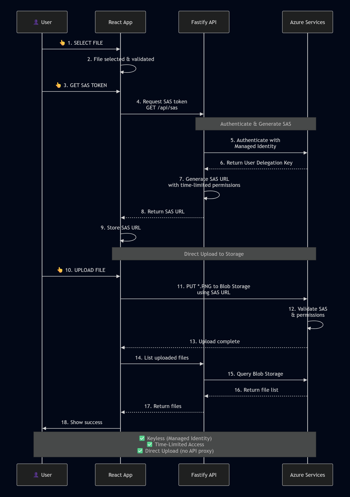
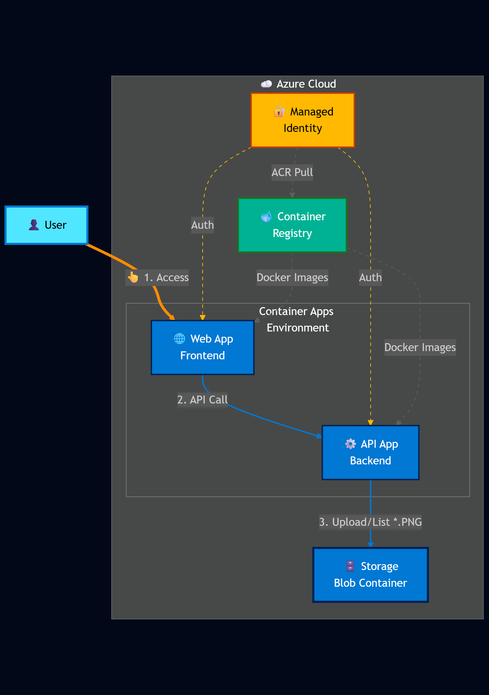
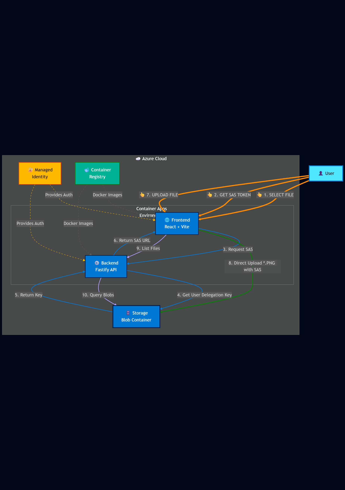
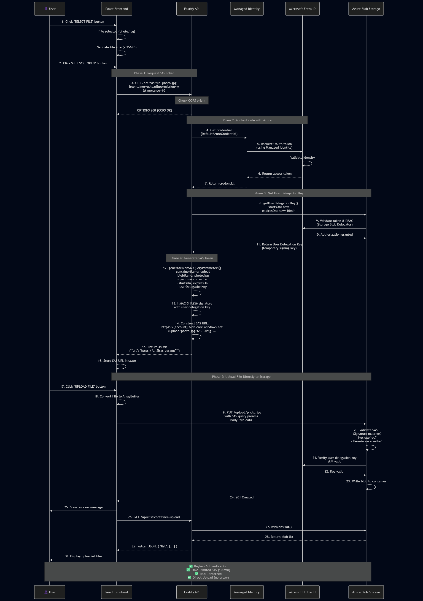

# Azure SAS Token File Upload - Documentation Guide

Welcome! This repository demonstrates **secure file upload to Azure Blob Storage using User Delegation SAS tokens** with keyless authentication (Managed Identity). This guide will help you understand the concepts, architecture, and implementation.


## 🎯 What You'll Learn

- How to implement **User Delegation SAS tokens** (the most secure SAS pattern)
- How to use **Azure Managed Identity** for keyless authentication
- How to build a **full-stack TypeScript application** with React and Fastify
- How to deploy to **Azure Container Apps** with Infrastructure as Code

## 📚 Documentation Journey

Follow this path to understand the repository from concept to implementation:

### 1️⃣ Start Here: Understanding the Scenario

**Goal:** Learn what SAS tokens are and why User Delegation SAS is the best practice.

📖 **Read First:** [SAS Token Architecture](./SAS-TOKEN-ARCHITECTURE.md)
- What are SAS tokens?
- Why User Delegation SAS over account keys?
- Security benefits and audit capabilities



**Key Concept:** This app demonstrates the **three-button user flow**:
1. 👆 **SELECT FILE** - User chooses a file
2. 👆 **GET SAS TOKEN** - App requests time-limited upload permission
3. 👆 **UPLOAD FILE** - User uploads directly to Azure Storage (no proxy)

---

### 2️⃣ See the Architecture

**Goal:** Visualize how components interact and where security happens.

📖 **Read:** [Architecture Diagrams](./DIAGRAMS.md)

**Visual Guides:**

| Diagram | What It Shows | When to Use |
|---------|--------------|-------------|
| <br/>**Simple Architecture** | High-level component overview | Quick understanding |
| <br/>**User Flow Architecture** | Three-button user interactions | Understanding user experience |
| <br/>**Detailed SAS Flow** | Complete security handshake | Understanding authentication |

**Key Takeaway:** Files upload **directly** from browser to Azure Storage using the SAS token. The API never proxies file data—it only provides short-lived access tokens.

---

### 3️⃣ Understand the Implementation

**Goal:** See how the code implements SAS token generation and usage.

📖 **Read:** [SAS Tokens Implementation Guide](./SAS-TOKENS.md)
- Code walkthrough of SAS generation
- Permission scoping (write-only access)
- Time-bound token expiration
- RBAC requirements

📖 **Read:** [Functional Specification](./FUNCTIONAL-SPEC.md)
- Detailed component responsibilities
- API endpoints and data contracts
- Frontend state management
- Error handling patterns

**Key Files to Review:**
```
azure-upload-file-storage/
├── api/src/routes/sas.ts          # SAS token generation
├── api/src/lib/azure-storage.ts   # Managed Identity setup
└── app/src/App.tsx                # Frontend upload logic
```

---

### 4️⃣ Run It Locally

**Goal:** Experience the application on your machine.

📖 **Read:** [Local Development Guide](./LOCAL-DEVELOPMENT.md)
- Docker Compose setup
- Azure Storage Emulator (Azurite)
- Environment variables
- Testing SAS token generation

**Quick Start:**
```bash
npm install
npm run dev        # Starts API (3000) + Frontend (5173)
```

📖 **Reference:** [Quick Commands](./QUICKSTART.md) - Common development commands

---

### 5️⃣ Deploy to Azure

**Goal:** Deploy the full application to Azure Container Apps.

📖 **Read:** [Deployment Guide](./DEPLOYMENT.md)
- Azure Developer CLI (azd) setup
- Bicep infrastructure provisioning
- Container Apps configuration
- Managed Identity assignment

**Quick Deploy:**
```bash
azd auth login
azd up              # Provision + Build + Deploy
```

📖 **Read:** [API Configuration](./CONFIGURATION-API.md) - Environment variables and settings

---

## 🔐 Security Highlights

This implementation follows **Azure security best practices**:

✅ **Keyless Authentication** - No storage account keys in code or config  
✅ **Managed Identity** - Automatic credential rotation  
✅ **User Delegation SAS** - Time-limited, permission-scoped tokens  
✅ **RBAC Enforcement** - Azure role-based access control  
✅ **Audit Trail** - All operations logged in Azure Activity Log  
✅ **Direct Upload** - Files never pass through API (reduces attack surface)

---

## 🏗️ Architecture at a Glance

```
┌─────────┐    👆 Click Buttons    ┌──────────────────┐
│  User   │─────────────────────▶ │  React Frontend  │
│ Browser │                        │   (Port 8080)    │
└─────────┘                        └──────────────────┘
                                            │
                                            │ 1. Request SAS Token
                                            ▼
                                   ┌──────────────────┐
                                   │  Fastify API     │
                                   │   (Port 3000)    │
                                   └──────────────────┘
                                            │
                                            │ 2. Get User Delegation Key
                                            │    (via Managed Identity)
                                            ▼
                    ┌─────────────────────────────────────────┐
                    │        ☁️  Azure Cloud                   │
                    │  ┌─────────────────────────────────┐   │
                    │  │ 🔐 Managed Identity (No Keys)   │   │
                    │  │     ↓                            │   │
                    │  │ 🗄️  Blob Storage Container       │   │
                    │  │     (Direct *.PNG Upload)        │   │
                    │  └─────────────────────────────────┘   │
                    └─────────────────────────────────────────┘
```

---

## 📖 Additional Resources

- [Authentication Flow](./auth.md) - Credential discovery and RBAC validation
- [Development Guide](./DEVELOPMENT.md) - Contribution guidelines and coding standards

---

## 🎓 Learning Path Summary

| Step | Document | Time | Purpose |
|------|----------|------|---------|
| 1 | [SAS Token Architecture](./SAS-TOKEN-ARCHITECTURE.md) | 10 min | Understand the "why" |
| 2 | [Architecture Diagrams](./DIAGRAMS.md) | 5 min | Visualize the system |
| 3 | [SAS Tokens Guide](./SAS-TOKENS.md) | 10 min | See the code |
| 4 | [Local Development](./LOCAL-DEVELOPMENT.md) | 20 min | Run it yourself |
| 5 | [Deployment Guide](./DEPLOYMENT.md) | 15 min | Deploy to Azure |

**Total Learning Time:** ~60 minutes from zero to deployed application

---

## 🚀 Quick Links

- **Start Local:** `npm run dev` ([Quick Commands](./QUICKSTART.md))
- **Deploy:** `azd up` ([Deployment Guide](./DEPLOYMENT.md))
- **Understand Security:** [SAS Token Architecture](./SAS-TOKEN-ARCHITECTURE.md)
- **See Diagrams:** [All Visual Guides](./DIAGRAMS.md)

---

## ❓ FAQ

**Q: Why not use storage account keys?**  
A: Storage account keys are like permanent passwords with unlimited access. User Delegation SAS uses identity-based, time-limited tokens that respect RBAC and provide audit trails.

**Q: Can users upload any file type?**  
A: The current implementation demonstrates *.PNG uploads, but the pattern works for any file type. Update the validation logic in the frontend as needed.

**Q: How long are SAS tokens valid?**  
A: By default, 10 minutes. This is configurable via the `timerange` query parameter when requesting a token.

**Q: What if the SAS token expires during upload?**  
A: The upload will fail with a 403 Forbidden error. Users must request a new token. The short expiration is intentional for security.

**Q: Does this work with Azure Storage Emulator?**  
A: Partially. See [Local Development Guide](./LOCAL-DEVELOPMENT.md) for Azurite setup.

---

## 🤝 Contributing

See [DEVELOPMENT.md](./DEVELOPMENT.md) for contribution guidelines.

---

**Ready to start?** 👉 Begin with [SAS Token Architecture](./SAS-TOKEN-ARCHITECTURE.md)
