# Azure Architecture: File Upload System

## Component Overview

| Component | Purpose | Configuration |
|-----------|---------|---------------|
| **Resource Group** | Container for all resources | Named with environment |
| **User-Assigned Managed Identity** | Secure authentication for apps | RBAC roles assigned |
| **Log Analytics Workspace** | Centralized logging | Used by Container Apps Environment |
| **Storage Account** | File upload destination | Standard_LRS, 'upload' container with public blob access |
| **Container Registry (ACR)** | Docker image storage | Basic SKU, admin enabled |
| **Container Apps Environment** | Hosting platform | Connected to Log Analytics |
| **API Container App** | Backend service | Port 3000, scales 0-1 replicas |
| **Web Container App** | Frontend UI | Port 8080, scales 1-3 replicas |

## Architecture Diagram

```mermaid
%%{init: {'theme':'base', 'themeVariables': { 'primaryColor':'#0078D4','primaryTextColor':'#fff','primaryBorderColor':'#0078D4','lineColor':'#0078D4','secondaryColor':'#50E6FF','tertiaryColor':'#fff','background':'#fff','mainBkg':'#E8F4FD','secondBkg':'#C7E0F4','tertiaryBkg':'#fff','nodeBorder':'#0078D4','clusterBkg':'#F0F0F0','clusterBorder':'#666','titleColor':'#000','edgeLabelBackground':'#fff'}}}%%

graph TB
    subgraph RG["Resource Group"]
        subgraph Identity["Security"]
            MI["User-Assigned<br/>Managed Identity<br/>🔐"]
        end
        
        subgraph Infrastructure["Infrastructure Layer"]
            SA["Storage Account<br/>📦<br/>'upload' container<br/>CORS enabled"]
            ACR["Container Registry<br/>🐳<br/>Basic SKU"]
            LAW["Log Analytics<br/>📊<br/>Workspace"]
        end
        
        subgraph Platform["Container Apps Environment"]
            API["API Container App<br/>⚙️<br/>Port 3000<br/>Scale 0-1"]
            WEB["Web Container App<br/>🌐<br/>Port 8080<br/>Scale 1-3"]
        end
    end
    
    USER["👤 Users"] -->|HTTPS| WEB
    WEB -->|API Calls| API
    API -->|Upload/List| SA
    
    MI -.->|Storage Blob Data<br/>Contributor| SA
    MI -.->|AcrPull| ACR
    ACR -.->|Pull Images| API
    ACR -.->|Pull Images| WEB
    LAW -.->|Logs & Metrics| API
    LAW -.->|Logs & Metrics| WEB
    MI -.->|Authenticate| API
    MI -.->|Authenticate| WEB

    classDef azureBlue fill:#0078D4,stroke:#005A9E,color:#fff,stroke-width:2px
    classDef azureLightBlue fill:#50E6FF,stroke:#0078D4,color:#000,stroke-width:2px
    classDef azureGreen fill:#00B294,stroke:#008272,color:#fff,stroke-width:2px
    classDef azurePurple fill:#5C2D91,stroke:#3C1A5B,color:#fff,stroke-width:2px
    
    class MI,API,WEB azureBlue
    class SA,ACR azureLightBlue
    class LAW azureGreen
    class USER azurePurple
```



## Simplified Architecture View

```mermaid
%%{init: {'theme':'base', 'themeVariables': { 'primaryColor':'#0078D4','primaryTextColor':'#fff','primaryBorderColor':'#0078D4','lineColor':'#0078D4','secondaryColor':'#50E6FF','tertiaryColor':'#fff'}}}%%

flowchart LR
    A["👤 User"] -->|1. Access| B["🌐 Web App<br/>Frontend"]
    B -->|2. API Call| C["⚙️ API App<br/>Backend"]
    C -->|3. Upload/List| D["📦 Storage<br/>Blob Container"]
    
    E["🔐 Managed<br/>Identity"] -.->|Auth| C
    E -.->|Auth| B
    F["🐳 Container<br/>Registry"] -.->|Images| B
    F -.->|Images| C
    
    style A fill:#5C2D91,stroke:#3C1A5B,color:#fff,stroke-width:2px
    style B fill:#0078D4,stroke:#005A9E,color:#fff,stroke-width:2px
    style C fill:#0078D4,stroke:#005A9E,color:#fff,stroke-width:2px
    style D fill:#50E6FF,stroke:#0078D4,color:#000,stroke-width:2px
    style E fill:#00B294,stroke:#008272,color:#fff,stroke-width:2px
    style F fill:#50E6FF,stroke:#0078D4,color:#000,stroke-width:2px
```



## Architecture Flow

### User Journey
1. **Users access** → Web Container App (public HTTPS endpoint)
2. **Web app calls** → API Container App (configured via VITE_API_URL)
3. **API processes** → Storage Account operations (upload/list files)
4. **Files stored in** → 'upload' blob container

### Security & Identity
- Managed Identity authenticates both container apps
- RBAC permissions grant storage and registry access
- No connection strings or keys in code

### Monitoring
- All container apps send logs to Log Analytics Workspace
- Centralized observability for debugging and performance

## Key Features

### Scalability
- **API**: Scale-to-zero capability (0-1 replicas) for cost optimization
- **Web**: Always available (1-3 replicas) for user experience

### Storage
- Public blob access for uploaded files
- CORS configuration allows browser uploads
- Managed identity eliminates credential management

### Container Management
- Images stored in private Azure Container Registry
- Automatic image pulls using managed identity
- No admin credentials needed in production

## ASCII Architecture Diagram

```
┌─────────────────────────────────────────────────────────────────────┐
│                         Resource Group                              │
│                                                                     │
│  ┌──────────────────────────────────────────────────────────────┐ │
│  │  User-Assigned Managed Identity                              │ │
│  │  • Storage Blob Data Contributor                             │ │
│  │  • Storage Blob Delegator                                    │ │
│  │  • AcrPull                                                    │ │
│  └────────┬───────────────────────────┬────────────┬────────────┘ │
│           │                           │            │              │
│           ▼                           ▼            ▼              │
│  ┌─────────────────┐        ┌──────────────────┐ ┌─────────────┐ │
│  │ Storage Account │        │ Container        │ │ Log         │ │
│  │                 │        │ Registry (ACR)   │ │ Analytics   │ │
│  │ • 'upload'      │        │                  │ │ Workspace   │ │
│  │   container     │        │ • Basic SKU      │ │             │ │
│  │ • CORS enabled  │        └──────────────────┘ └──────┬──────┘ │
│  │ • Public access │                │                   │        │
│  └────────▲────────┘                │                   │        │
│           │                         │                   │        │
│           │         ┌───────────────┴───────────────────▼──────┐ │
│           │         │ Container Apps Environment               │ │
│           │         │                                          │ │
│           │         │  ┌────────────────┐  ┌────────────────┐ │ │
│           │         │  │ API Container  │  │ Web Container  │ │ │
│           │         │  │ App            │  │ App            │ │ │
│           └─────────┼──│ • Port 3000    │  │ • Port 8080    │ │ │
│                     │  │ • Scale 0-1    │  │ • Scale 1-3    │ │ │
│                     │  │ • Node.js API  │◄─┤ • Frontend UI  │ │ │
│                     │  └────────────────┘  └────────────────┘ │ │
│                     │         (pulls images from ACR)         │ │
│                     └──────────────────────────────────────────┘ │
│                                                                   │
│  Internet ──► Web App (HTTPS) ──► API App (HTTPS) ──► Storage   │
└───────────────────────────────────────────────────────────────────┘
```

## Azure Resources Created

The Bicep template deploys the following Azure resources:

1. **Resource Group** - Contains all infrastructure resources
2. **User-Assigned Managed Identity** - Provides secure authentication
3. **Storage Account** (Standard_LRS)
   - Blob container named 'upload'
   - Public blob access enabled
   - CORS configured for browser uploads
4. **Azure Container Registry** (Basic SKU)
   - Stores Docker images for both apps
5. **Log Analytics Workspace**
   - Collects logs and metrics
6. **Container Apps Environment**
   - Managed environment for container apps
7. **API Container App**
   - Node.js backend service
   - Connects to Storage Account
   - Scales 0-1 replicas
8. **Web Container App**
   - Frontend application
   - Connects to API
   - Scales 1-3 replicas

## RBAC Role Assignments

### Managed Identity Roles
- **Storage Blob Data Contributor** on Storage Account
- **Storage Blob Delegator** on Storage Account
- **AcrPull** on Container Registry

### User Roles (Optional)
If `principalId` parameter is provided:
- **Storage Blob Data Contributor** on Storage Account
- **Storage Blob Delegator** on Storage Account
- **AcrPull** on Container Registry

## Deployment Outputs

The Bicep template outputs the following values:

- `AZURE_LOCATION` - Azure region
- `AZURE_TENANT_ID` - Tenant ID
- `AZURE_RESOURCE_GROUP` - Resource group name
- `AZURE_CONTAINER_REGISTRY_ENDPOINT` - ACR login server
- `AZURE_CONTAINER_REGISTRY_NAME` - ACR name
- `AZURE_CONTAINER_ENVIRONMENT_NAME` - Container Apps Environment name
- `AZURE_CONTAINER_APP_API_NAME` - API app name
- `AZURE_CONTAINER_APP_WEB_NAME` - Web app name
- `API_URL` - HTTPS URL for API app
- `WEB_URL` - HTTPS URL for Web app
- `AZURE_STORAGE_ACCOUNT_NAME` - Storage account name
- `AZURE_STORAGE_BLOB_ENDPOINT` - Blob endpoint URL with 'upload' path

## Best Practices Implemented

This architecture follows Azure best practices:

- ✅ **Reliability**: Scale configuration ensures availability
- ✅ **Security**: Managed identities eliminate credential management
- ✅ **Cost Optimization**: Scale-to-zero for API reduces costs
- ✅ **Operational Excellence**: Centralized logging via Log Analytics
- ✅ **Performance Efficiency**: Container Apps provide serverless scaling
